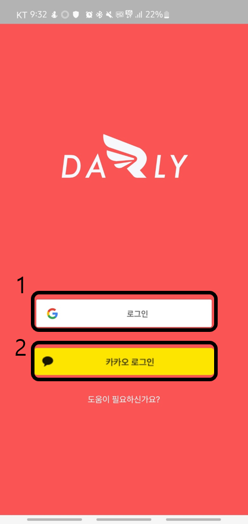
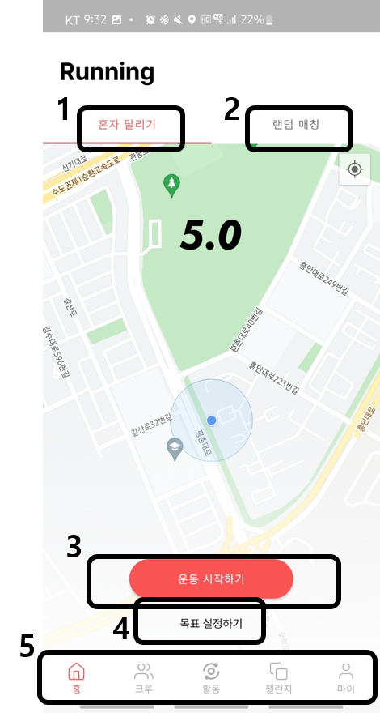
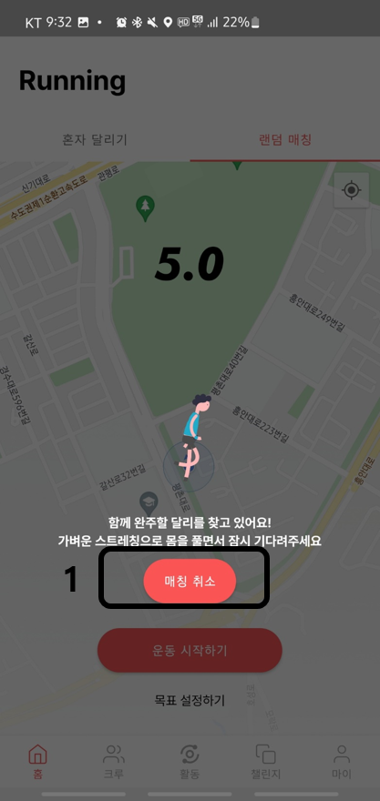
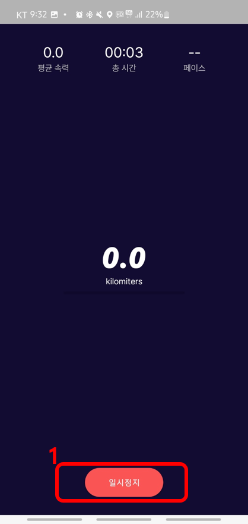
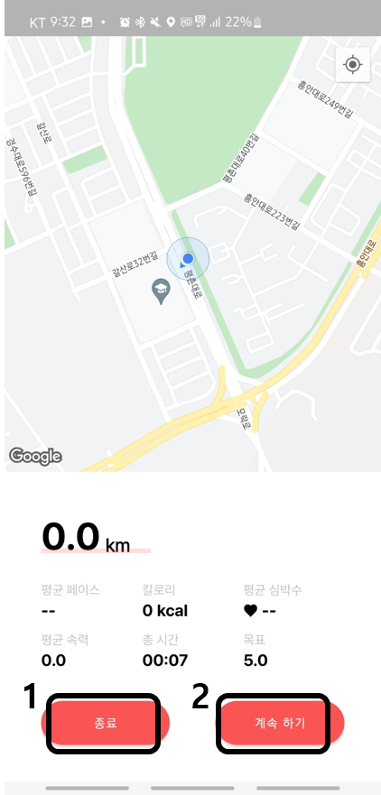
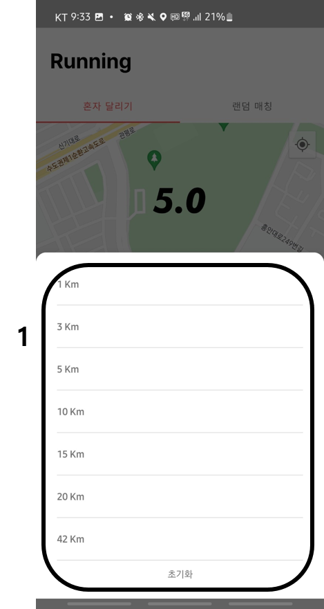
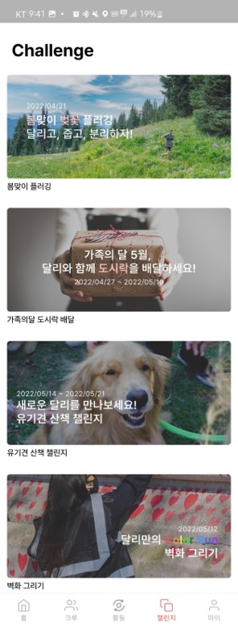

# 시연 시나리오

메뉴로는 홈, 크루, 활동, 챌린지, 마이페이지가 있습니다

 

## 1. 홈

### 1-1) 로그인

로그인을 할 수 있는 첫페이지입니다

| 번호 | 기능               |
| ---- | ------------------ |
| 1    | 구글 소셜 로그인   |
| 2    | 카카오 소셜 로그인 |

 

### 1-2) 메인 활동 기록

혼자달리기와 랜덤매칭을 할 수 있는 메인화면입니다

| 번호 | 기능                                                                                                                                                             |
| ---- | ---------------------------------------------------------------------------------------------------------------------------------------------------------------- |
| 1    | 혼자달리기 기능으로, 3번 버튼을 통해 운동을 시작할 수 있습니다.                                                                                                  |
| 2    | 랜덤매칭 기능으로, 랜덤매칭을 원하는 타인과 1대1경쟁을 시작하게 됩니다. 랜덤매칭을 누른 후 운동 시작하기 버튼을 누르면 1-3화면이 나타나고 매칭을 대기하게 됩니다 |
| 3    | 혼자달리기 기능을 시작하면 1-4화면으로 이동하고 측정한 기간동안의 거리, 속도, 페이스 등을 확인할 수 있습니다                                                     |
| 4    | 목표를 설정할 수 있는 버튼으로, 클릭하면 1-6화면이 나타나며 목표를 설정할 수 있습니다                                                                            |
| 5    | 메뉴탭으로 홈, 크루, 활동, 챌린지, 마이페이지로 이동할 수 있습니다                                                                                               |

 

### 1-3) 랜덤 매칭

랜덤매칭을 대기합니다

| 번호 | 기능                                               |
| ---- | -------------------------------------------------- |
| 1    | 매칭취소 버튼을 통해 랜덤매칭을 취소할 수 있습니다 |

 

### 1-4) 혼자 달리기 기록

혼자 달리기를 기록중입니다.
일시정지하기 전까지 달린 총 거리, 평균속력, 시간, 페이스를 확인할 수 있으며 목표거리대비 실제 운동한 거리 비율을 프로그래스바를 통해 확인할 수 있습니다.
휴대폰 화면을 꺼도 백그라운드에서 돌아갑니다.

| 번호 | 기능                                                                                 |
| ---- | ------------------------------------------------------------------------------------ |
| 1    | 일시정지 버튼을 통해 기록을 중단할 수 있습니다. 버튼을 누르면 1-5화면으로 이동합니다 |

 

### 1-5) 혼자 달리기 일시정지

혼자달리기를 중단한 화면이며 내가 지금까지 이동한 경로를 붉은 선으로 표시해 주기에 시각적으로 확인할 수 있으며, 평균 페이스, 소모된 칼로리, 평균속력, 총 시간등의 정보를 확인할 수 있습니다.

| 번호 | 기능                                                                                  |
| ---- | ------------------------------------------------------------------------------------- |
| 1    | 종료버튼을 통해 기록을 종료 및 저장할 수 있고 버튼을 클릭하면 1-7화면으로 이동합니다  |
| 2    | 계속하기 버튼을 통해 기록을 이어갈 수 있으며 버튼을 클릭하면 1-4화면으로 되돌아갑니다 |

 

### 1-6) 목표설정하기

목표거리를 변경합니다

| 번호 | 기능                     |
| ---- | ------------------------ |
| 1    | 원하는 목표를 선택합니다 |

 

### 1-7) 혼자달리기 저장

혼자달리기를 종료한 후 저장합니다.
기록제목을 설정할수있으며 설정하지 않으면 요일+시간대+러닝 으로 제목이 설정됩니다.
달린 거리를 붉은 선으로 표시해줘 시각적으로 확인할 수 있으며 페이스, 칼로리등의 러닝을 하며 얻은 정보들과 1키로미터 단위로 구간을 나눈 페이스 정보를 확인할 수 있습니다.
또한 개인 피드에 이미지를 업로드 할 수 있습니다

| 번호 | 기능                                                                              |
| ---- | --------------------------------------------------------------------------------- |
| 1    | 기록제목을 설정할수있으며 설정하지 않으면 요일+시간대+러닝 으로 제목이 설정됩니다 |
| 2    | 저장버튼으로 클릭하면 1-2화면으로 돌아갑니다                                      |
| 3    | 클릭하면 카메라로 이동하고, 촬영한 이미지는 마이페이지 탭의 피드에 저장됩니다     |

 

## 2. 크루

 

 

## 3. 활동

 

## 4. 챌린지

### 4-1) 진행중인 챌린지 목록

진행중인 챌린지들을 확인할 수 있습니다

 

## 5. 마이페이지

 
