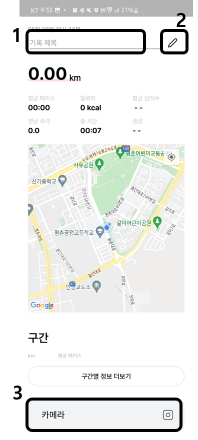
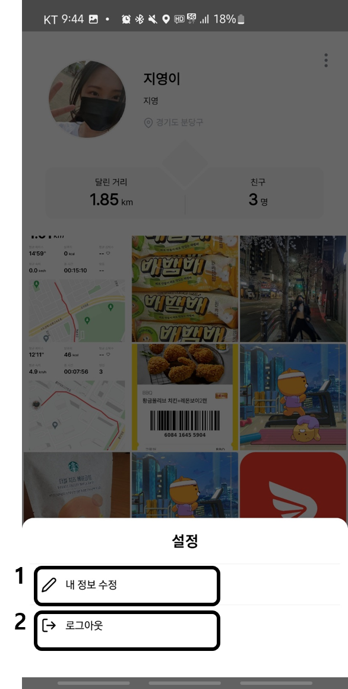

# 시연 시나리오

메뉴로는 홈, 크루, 활동, 챌린지, 마이페이지가 있습니다

 

## 1. 홈

### 1-1) 로그인

로그인을 할 수 있는 첫페이지입니다

| 번호 | 기능               |
| ---- | ------------------ |
| 1    | 구글 소셜 로그인   |
| 2    | 카카오 소셜 로그인 |

 

### 1-2) 메인 활동 기록

혼자달리기와 랜덤매칭을 할 수 있는 메인화면입니다

| 번호 | 기능                                                                                                                                                             |
| ---- | ---------------------------------------------------------------------------------------------------------------------------------------------------------------- |
| 1    | 혼자달리기 기능으로, 3번 버튼을 통해 운동을 시작할 수 있습니다.                                                                                                  |
| 2    | 랜덤매칭 기능으로, 랜덤매칭을 원하는 타인과 1대1경쟁을 시작하게 됩니다. 랜덤매칭을 누른 후 운동 시작하기 버튼을 누르면 1-3화면이 나타나고 매칭을 대기하게 됩니다 |
| 3    | 혼자달리기 기능을 시작하면 1-4화면으로 이동하고 측정한 기간동안의 거리, 속도, 페이스 등을 확인할 수 있습니다                                                     |
| 4    | 목표를 설정할 수 있는 버튼으로, 클릭하면 1-6화면이 나타나며 목표를 설정할 수 있습니다                                                                            |
| 5    | 메뉴탭으로 홈, 크루, 활동, 챌린지, 마이페이지로 이동할 수 있습니다                                                                                               |

 

### 1-3) 랜덤 매칭

랜덤매칭을 대기합니다

| 번호 | 기능                                               |
| ---- | -------------------------------------------------- |
| 1    | 매칭취소 버튼을 통해 랜덤매칭을 취소할 수 있습니다 |

 

### 1-4) 혼자 달리기 기록

혼자 달리기를 기록중입니다.
일시정지하기 전까지 달린 총 거리, 평균속력, 시간, 페이스를 확인할 수 있으며 목표거리대비 실제 운동한 거리 비율을 프로그래스바를 통해 확인할 수 있습니다.
휴대폰 화면을 꺼도 백그라운드에서 돌아갑니다.

| 번호 | 기능                                                                                 |
| ---- | ------------------------------------------------------------------------------------ |
| 1    | 일시정지 버튼을 통해 기록을 중단할 수 있습니다. 버튼을 누르면 1-5화면으로 이동합니다 |

 

### 1-5) 혼자 달리기 일시정지

혼자달리기를 중단한 화면이며 내가 지금까지 이동한 경로를 붉은 선으로 표시해 주기에 시각적으로 확인할 수 있으며, 평균 페이스, 소모된 칼로리, 평균속력, 총 시간등의 정보를 확인할 수 있습니다.

| 번호 | 기능                                                                                  |
| ---- | ------------------------------------------------------------------------------------- |
| 1    | 종료버튼을 통해 기록을 종료 및 저장할 수 있고 버튼을 클릭하면 1-7화면으로 이동합니다  |
| 2    | 계속하기 버튼을 통해 기록을 이어갈 수 있으며 버튼을 클릭하면 1-4화면으로 되돌아갑니다 |

 

### 1-6) 목표설정하기

목표거리를 변경합니다

| 번호 | 기능                     |
| ---- | ------------------------ |
| 1    | 원하는 목표를 선택합니다 |

 

### 1-7) 혼자달리기 저장

혼자달리기를 종료한 후 저장합니다.
기록제목을 설정할수있으며 설정하지 않으면 요일+시간대+러닝 으로 제목이 설정됩니다.
달린 거리를 붉은 선으로 표시해줘 시각적으로 확인할 수 있으며 페이스, 칼로리등의 러닝을 하며 얻은 정보들과 1키로미터 단위로 구간을 나눈 페이스 정보를 확인할 수 있습니다.
또한 개인 피드에 이미지를 업로드 할 수 있습니다

| 번호 | 기능                                                                              |
| ---- | --------------------------------------------------------------------------------- |
| 1    | 기록제목을 설정할수있으며 설정하지 않으면 요일+시간대+러닝 으로 제목이 설정됩니다 |
| 2    | 저장버튼으로 클릭하면 1-2화면으로 돌아갑니다                                      |
| 3    | 클릭하면 카메라로 이동하고, 촬영한 이미지는 마이페이지 탭의 피드에 저장됩니다     |

 

## 2. 크루

 

### 2-1) 크루 목록

내가 가입한 크루들과 마이페이지에서 설정한 지역을 기준으로 추천되는 크루들을 확인할 수 있습니다
모든 크루 보기버튼을 통해 추천 크루뿐만 아니라 모든 크루들을 확인하고 가입할 수 있으며 새로운 크루를 생성할수도 있습니다

| 번호 | 기능                                                                                                  |
| ---- | ----------------------------------------------------------------------------------------------------- |
| 1    | 검색버튼으로 모든 크루를 검색해 볼 수 있는 2-2화면으로 이동합니다                                     |
| 2    | 크루 생성 버튼으로 새로운 크루를 생성할 수 있는 2-3화면으로 이동합니다                                |
| 3    | 내가 가입한 크루 목록들로 각각을 클릭하면 크루 상세페이지인 2-4화면으로 이동합니다                    |
| 4    | 가입하지 않은 내 지역의 크루들이 추천됩니다. 각각을 클릭하면 크루 상세페이지인 2-4화면으로 이동합니다 |

 

### 2-2) 모든 크루 목록

크루 이름을 기준으로 크루들을 검색할 수 있습니다

| 번호 | 기능                                                                   |
| ---- | ---------------------------------------------------------------------- |
| 1    | 크루 이름을 기준으로 크루를 검색할 수 있습니다                         |
| 2    | 크루 생성 버튼으로 새로운 크루를 생성할 수 있는 2-3화면으로 이동합니다 |
| 4    | 각각을 클릭하면 크루 상세페이지인 2-4화면으로 이동합니다               |

 

### 2-3) 크루 생성

크루를 생성할 수 있습니다.
사진, 크루명, 활동지역, 크루 소개글, 가입방법을 기입하고 크루를 생성합니다

| 번호 | 기능                                                                                                                          |
| ---- | ----------------------------------------------------------------------------------------------------------------------------- |
| 1    | 앨범의 이미지를 선택합니다                                                                                                    |
| 2    | 크루명을 입력합니다                                                                                                           |
| 3    | 활동지역을 한개 선택합니다. 클릭하면 5-5의 지역선택화면으로 이동합니다                                                        |
| 4    | 크루소개글을 입력합니다                                                                                                       |
| 5    | 가입방법을 선택합니다. 바로가입의 경우 신청시 바로 가입되고, 승인 후 가입의 경우 크루장의 승인을 받은 후에 크루에 가입됩니다. |
| 6    | 완료 버튼을 통해 크루 생성을 완료합니다                                                                                       |

 

### 2-4) 크루 상세보기

크루의 상세 내용을 확인합니다.
크루원들의 총합 달린거리, 시간이나 크루원 각각의 페이스, 달린시간, 순위등을 확인하는 요약탭과
크루원들이 생성한 피드 내용들을 확인할 수 있는 피드 탭, 그리고 대기중이거나 진행중인 경쟁방 목록들을 볼 수 있는 경쟁탭이 존재합니다.
크루원이 아닌 경우 요약탭만 확인 가능하며 피드, 경쟁방은 확인할 수 없습니다

| 번호 | 기능                                                                                                        |
| ---- | ----------------------------------------------------------------------------------------------------------- |
| 1    | 피드 업로드와 경쟁방 만들기를 할 수 있는 2-5화면이 보여집니다                                               |
| 2    | 총합 달린거리, 시간이나 크루원 각각의 페이스, 달린시간 및 순위등을 확인하는 요약탭으로 현재 화면이 보입니다 |
| 3    | 크루원들이 생성한 피드 목록들을 확인할 수 있는 2-6화면으로 이동합니다                                       |
| 4    | 대기중이거나 진행중인 경쟁방 목록들을 볼 수 있는 2-9화면으로 이동합니다                                     |

 

### 2-5) 피드 업로드, 경쟁방 만들기

크루원의 경우 피드와 경쟁방을 만들수 있습니다

| 번호 | 기능                                                                               |
| ---- | ---------------------------------------------------------------------------------- |
| 1    | 피드 업로드를 할 수 있는 2-7화면으로 이동하고 생성된 피드는 2-6화면에서 보여집니다 |
| 2    | 경쟁방을 만들 수 있는 2-10화면으로 이동하며 생성된 방은 2-9화면에서 보여집니다     |

 

### 2-6) 피드 목록

크루원들이 업로드한 피드 목록들을 그리드 형식으로 확인할 수 있습니다
각각의 피드를 클릭하면 상세보기 페이지로 이동합니다

| 번호 | 기능                                                                                                  |
| ---- | ----------------------------------------------------------------------------------------------------- |
| 1    | 각각의 피드들을 클릭하면 피드 생성자와 피드 이미지, 내용을 모두 확인할 수 있는 2-8화면으로 이동합니다 |

 

### 2-7) 피드 생성

피드를 생성할 수 있습니다. 생성한 피드는 2-6, 2-8화면에 추가됩니다

| 번호 | 기능                         |
| ---- | ---------------------------- |
| 1    | 앨범에서 이미지를 선택합니다 |
| 2    | 피드 내용을 입력합니다       |

 

### 2-8) 피드 상세보기

피드 상세 내용들을 무한 스크롤 형식으로 출력합니다. 누른 피드로 포커스가 이동하며 위로 올리거나 내려 생성된 순서대로 피드들을 이어서 볼 수 있습니다

 

### 2-9) 경쟁방 목록

경쟁중이거나 대기중인 경쟁방 목록을 확인할 수 있습니다.
이미 시작된 경쟁방은 입장할 수 없으며 종료된 경쟁방은 목록에 보이지 않습니다.
각 경쟁방에서 목표로하는 달리기 거리와 제목, 방장, 참여인원수 등을 확인할 수 있습니다
대기중인 경쟁방을 클릭하면 2-11화면으로 이동합니다

 

### 2-10) 경쟁방 생성

경쟁방을 생성할 수 있습니다. 생성된 경쟁방은 2-9화면에 추가됩니다

| 번호 | 기능                  |
| ---- | --------------------- |
| 1    | 제목을 입력합니다     |
| 2    | 목표거리를 설정합니다 |

 

### 2-11) 경쟁방 입장

경쟁방에 대기중인 인원들을 확인할 수 있습니다
참가자의 경우 레디버튼을 눌러 레디를 하고, 방장의 경우 모든 참가자들이 레디 된 경우 활성화된 시작버튼을 통해 경쟁을 시작할 수 있습니다

| 번호 | 기능                                                                                                                                                                                                                                                                    |
| ---- | ----------------------------------------------------------------------------------------------------------------------------------------------------------------------------------------------------------------------------------------------------------------------- |
| 1    | 참가자의 경우 레디버튼, 방장의 경우 시작버튼으로 보여집니다. 참가자는 레디버튼을 통해 레디 활성화/비활성화 상태로 전환할 수 있으며 방장의 경우 모든 참가자들이 레디 된 경우 시작버튼이 활성화 되어 경쟁을 시작할 수 있습니다. 경쟁이 시작된경우 2-12화면으로 이동합니다 |

 

### 2-12) 경쟁

경쟁 방 참가자들과 경쟁합니다.
화면의 중앙에는 나의 등수, 총 시간, 페이스, 총 달린거리등이 표시되며 상단에는 다른 크루원들의 순위, 페이스, 달린 거리등을 확인할 수 있습니다.
상단의 화면은 좌우로 슬라이드하여 다른 순위의 크루원들을 확인할 수 있습니다.
1등이 목표거리를 완료하면 경쟁이 종료되고 순위가 동결됩니다

| 번호 | 기능                                                        |
| ---- | ----------------------------------------------------------- |
| 1    | 경쟁이 종료된경우 종료버튼을 눌러 기록을 저장할 수 있습니다 |

 

## 3. 활동

### 3-1) 활동 통계

기록된 활동 통계, 기록, 달성한 도전들, 참여한 챌린지들을 확인할 수 있습니다
주/월/년/전체 단위의 달린 거리, 횟수, 평균페이스, 시간등을 확인할 수 있으며 그래프를 통해 시각적으로 나타내줍니다.
가장 최근에 저장된 기록 3개를 보여주며 더보기 페이지로 이동할 수 있습니다.
가장 최근에 달성한 도전 3개를 보여주며 더보기 페이지로 이동할 수 있습니다.
참여한 챌린지 목록들을 확인할 수 있습니다.

| 번호 | 기능                                                                                   |
| ---- | -------------------------------------------------------------------------------------- |
| 1    | 주/월/년/전체 단위의 그래프를 선택할 수 있는 버튼입니다                                |
| 2    | 각 기록의 대략적인 정보를 확인할 수 있고 각각의 기록을 클릭하면 3-2화면으로 이동합니다 |
| 3    | 저장된 모든 최근기록 목록을 보여주는 페이지로 이동합니다                               |
| 4    | 달성한 모든 도전들을 보여주는 페이지로 이동합니다                                      |

 

### 3-2) 기록 상세보기

저장된 기록을 상세한 정보를 볼수 있습니다
제목을 편집할 수 있고거리, 페이스, 소모칼로리, 속력, 시간을 확인할 수 있고, 지도상에서 움직인 경로 및 시작위치, 종료위치를 확인할 수 있습니다. 시작위치에는 프로필사진이 위치합니다.
구간별 상세기록을 확인할 수 있고, 경쟁을 통한 기록인 경우 랭킹정보가 보여집니다.

| 번호 | 기능                                                                       |
| ---- | -------------------------------------------------------------------------- |
| 1,2  | 제목을 편집할 수 있습니다                                                  |
| 3    | 클릭하면 3-3화면으로 이동하며 구간별 칼로리, 페이스등을 확인할 수 있습니다 |

 

### 3-3) 구간별 상세보기

조금 더 상세한 구간별 기록을 볼 수 있습니다.

 

 

## 4. 챌린지

### 4-1) 진행중인 챌린지 목록

진행중인 챌린지들을 확인할 수 있습니다

 

## 5. 마이페이지

 

### 5-1) 마이 페이지

내 정보와 피드들을 확인할 수 있는 마이페이지입니다.
내 정보 수정 및 로그아웃이 가능하며, 총 달린거리와 친구들을 관리할 수 있습니다.
지금까지 저장한 피드목록을 확인할 수 있습니다.

| 번호 | 기능                                                                            |
| ---- | ------------------------------------------------------------------------------- |
| 1    | 버튼을 클릭하면 5-3화면이 나타나며 내정보 수정 및 로그아웃을 이용할 수 있습니다 |
| 2    | 클릭하면 내 친구들을 관리할 수 있는5-6화면으로 이동합니다                       |
| 3    | 각 피드를 클릭하면 피드를 크게 보여주는 5-2화면이 나타납니다                    |

 

### 5-2) 피드 상세보기

각 피드를 크게 확인할 수 있습니다

 

### 5-3) 설정 다이알로그

내 정보 수정과 로그아웃이 가능합니다

| 번호 | 기능                                                            |
| ---- | --------------------------------------------------------------- |
| 1    | 버튼을 클릭하면 내 정보를 수정할 수 있는 5-4화면으로 이동합니다 |
| 2    | 버튼을 클릭하면 로그아웃하여 1-1화면으로 되돌아갑니다           |

 

### 5-4) 내 정보 수정

내 정보를 수정할 수 있습니다
프로필 사진, 닉네임, 상태메세지, 지역설정이 가능합니다
닉네임은 중복될 수 없으며 한글, 영어, 숫자만 입력 가능합니다
지역은 1개이상, 4개이하로 설정할 수 있습니다

| 번호 | 기능                                                                         |
| ---- | ---------------------------------------------------------------------------- |
| 1    | 앨범에서 프로필 사진을 선택할 수 있습니다                                    |
| 2    | 중복되지 않는 닉네임으롯 수정할 수 있으며 한글, 영어, 숫자만 입력 가능합니다 |
| 3    | 상태메세지를 수정할 수 있습니다                                              |
| 4    | 지역을 추가할 수 있으며 클릭하면 5-5화면으로 이동합니다                      |
| 5    | 등록된 지역들을 삭제할 수 있습니다                                           |

 

### 5-5) 지역 선택

시/군/구 단위의 지역을 검색하고, 선택할 수 있습니다

| 번호 | 기능                                                                 |
| ---- | -------------------------------------------------------------------- |
| 1    | 지역을 검색할 수 있습니다                                            |
| 2    | 검색된 지역을 선택하면 5-4페이지로 이동하며 선택한 지역이 추가됩니다 |

 

### 5-6) 친구목록

친구 목록을 확인하고 친구를 관리할 수 있습니다

| 번호 | 기능                                                            |
| ---- | --------------------------------------------------------------- |
| 1    | 클릭하면 친구 추가를 할 수 있는 5-8 화면으로 이동합니다         |
| 2    | 닉네임을 기준으로 친구를 검색합니다                             |
| 3    | 클릭하면 친구신청 목록을 확인할 수 있는 5-7 화면으로 이동합니다 |
| 4    | 친구 각각을 클릭하면 친구의 프로필 화면을 볼 수 있습니다        |
| 5    | 친구를 삭제할 수 있습니다                                       |

 

### 5-7) 친구 신청 목록

친구 신청 목록을 확인하고, 수락 또는 거절할 수 있습니다

| 번호 | 기능                                    |
| ---- | --------------------------------------- |
| 1    | 닉네임을 기준으로 친구신청을 검색합니다 |
| 2    | 수락/거절 할 수 있습니다                |

 

### 5-8) 친구 신청 목록

친구를 검색하고 추가할 수 있습니다

| 번호 | 기능                                       |
| ---- | ------------------------------------------ |
| 1    | 닉네임을 기준으로 새로운 친구를 검색합니다 |
| 2    | 친구신청을 할 수 있습니다                  |

 
